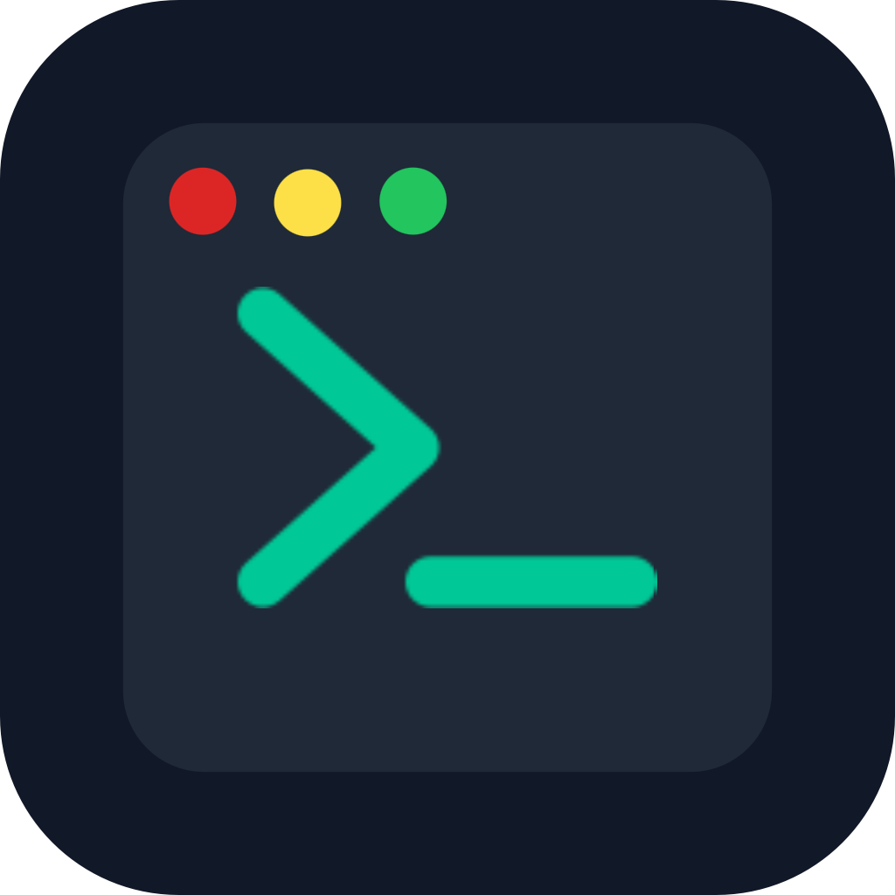

<h1 align="center">
  
   
  TerminalNotes
</h1>

  A developer operating system — your notebook, terminal, project workspace, and social platform in one place.

  <a href="https://terminalnotes.netlify.app">https://terminalnotes.netlify.app</a>

---

## What is TerminalNotes?

**TerminalNotes is the all-in-one environment built for developers who want to think, build, document, and share:**

- Write structured notebooks with terminal-style command blocks
- Capture ideas and convert them into fully tracked projects
- Connect GitHub repositories to your projects and notebooks
- Visualize project history with a built-in timeline mode
- Share your work and follow other developers on a social feed

**`GitHub + Notion + a Linux terminal + a personal developer journal + social media`**

---

## How It Works

Getting started with TerminalNotes is fast:

1. **Sign in with GitHub** — Authenticate with your GitHub account to get started instantly and unlock repository integration.
2. **Create a Notebook** — Organize your knowledge into structured notebooks — commands, notes, terminology, and learning materials all in one place.
3. **Capture an Idea** — Log early concepts and inspirations as ideas, using them as a brainstorming space before committing to a project.
4. **Convert to a Project** — Promote ideas into full projects with notes, commands, timelines, and GitHub repository links attached.
5. **Publish and Share** — Make notebooks, projects, or command libraries public and engage with other developers through the social feed.

> [!TIP]
> Keep your notebooks private while you're working and publish them only when you're ready — content visibility is fully controlled by you.

---

## Features

- **Notebook System** — Create structured, book-like notebooks with command blocks rendered in a mini terminal style — perfect for documenting programming workflows.
- **Ideas & Projects Workflow** — Capture raw ideas, refine them into projects, and track progress through the natural flow: Idea → Project → Development → Documentation.
- **GitHub Integration** — Sign in with GitHub to display your repositories and link them directly to projects or notebooks.
- **Timeline Mode** — Enable a visual project timeline to track work sessions, milestones, and the full evolution of a project over time.
- **Developer Social Platform** — Follow other developers, publish your work, explore a live activity feed, and discover content through global search.

---

## Screenshots

  

---

## Data & Privacy

TerminalNotes stores your notebooks, ideas, projects, and profile data securely. All content is private by default — nothing is visible to other users unless you explicitly choose to publish it.

> [!NOTE]
> GitHub authentication is used only for sign-in and optional repository linking. TerminalNotes does not store your GitHub credentials.

> [!WARNING]
> Once content is published publicly, it may be visible to other users on the platform. Review your privacy settings before publishing.

---

<h3 align="center">
TerminalNotes does not accept feature implementations via pull requests. Feature requests and bug reports are welcome through GitHub issues.
</h3>

---

  © 2026 Niko Marinović. All rights reserved.

